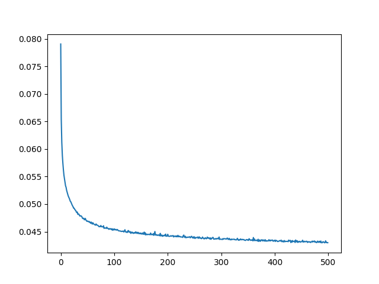

# RL Pusher  
By Dexter Friis-Hecht and Dokyun Kim  

# Project Description  
In this project, we aim to deepen our understanding of reinforcment learning by implementing Imitation Learning and Deep Reinforcement Learning in the [Minari Pusher environment](https://gymnasium.farama.org/environments/mujoco/pusher/). The pusher environment has a 7-DOF manipulator whose task is to push a cylindrical object into the goal (marked in red).  

Our stretch goal is to implement the same techniques for a [Panda Gym environment](https://github.com/qgallouedec/panda-gym), which offers more advanced robot arm tasks. 

**INSERT IMAGE OF PUSHER ENVIRONMENT**

# Methodology
In this section, we will cover basic concepts of reinforcement learning and explain the two methods we used. 

## Terminology
We will define some terminology that will be used in the following sections.  

**Agent**: The decision-maker that interacts with the environment (This is the arm in our case)

**Environment**: The system or world in which the agent operates. (This is the table)

**Action Space**: The set of all possible actions the agent can take in the environment. ($A$)    

**Observation Space**: The set of all possible observations or states the agent can perceive. ($S$)

**Policy**: The agent’s strategy for deciding which action to take given an observation. ($\pi$)

**Reward**: A value indicating the "quality" of an action. The agent adjusts its policy to maximize this.

## Imitation Learning (Behavior Cloning)
*Note* For this section, we will be referring to the Mujoco Pusher environment, but note that the Panda-Gym environment follows the same architecture, just with different values.  

The idea behind imitation learning is quite straightforward. Given an expert demonstration of the task we want the model to perform, can we make the model learn the expert's policy? We implement this using Behavior Cloning, which has one of the simplest architectures.  

<!-- Add expert demonstration GIF -->

In behavior cloning, the agent is initialized with no information about the environment. Given an observation, it will take an action which will most likely be wrong. However, since we have the expert demonstration, aka the "correct action" to take at a given observation, we can compare the expert's action with our agent's action and make our agent learn the expert policy.  

Given a dataset $\mathcal{D}$ that contains expert demonstrations $\{s_i, a_i\}_{i=1}^N$ where $N = \text{number of episodes}$, we want to find a policy $\pi^{\theta}$ that mimics the expert's policy. $\pi^{\theta}$ maps states ($S$) to actions ($A$), and is parameterized by $\theta$.  

The goal of the behavior cloning network is to minimize the difference between the policy's action ($\pi^\theta(s_i)$) and expert action ($a_i$). Since the action space of Pusher is continous, the loss function can be defined using the Mean Squared Error loss.

$$\mathcal{L}(\theta) = \frac{1}{N}\sum_{i=1}^N \left\Vert \pi^\theta(s_i) - a_i \right\Vert^2$$

The model will optimize the network parameters $\theta$ to find $\theta^*$ that minimizes $\mathcal{L}(\theta)$ using backpropagation.

$$\theta^* = \underset{\theta}{\mathrm{argmin}} \, \mathcal{L}(\theta)$$

Pusher's action consists of 7 different torques applied at different joints, which can be represented as a $7 \text{x} 1$ vector. The observation consists of 23 values containing information about the arm, cylinder and goal, which can be represented as a $23 \text{x} 1$ vector. We want to define a neural network which takes the observation vector as the input and returns the appropriate action as the output. The network is shown below:

  

The network architecture is a simple Multi-Layer Perceptron with 2 hidden layers. For the Pusher environment, the first hidden layer has 256 neurons and the second layer has 128 neurons.

### Training and Evaluation
The network was trained for 500 epochs on 5000 episodes of expert demonstration using a NVIDIA RTX A1000 Laptop GPU. Training time was approximately 35 minutes.  

The training loss graph is shown below.

  

<!-- Add trained agent GIF -->

## Deep Reinforcement Learning (Proximal Policy Optimization)

# Lessons Learned

