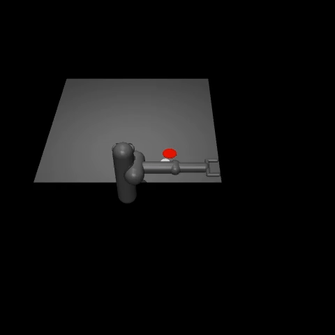

# RL Pusher  
By Dexter Friis-Hecht and Dokyun Kim  

# Project Description  
In this project, we aim to deepen our understanding of reinforcement learning by implementing Imitation Learning and Deep Reinforcement Learning in the [Minari Pusher environment](https://gymnasium.farama.org/environments/mujoco/pusher/). The pusher environment has a 7-DOF manipulator whose task is to push a cylindrical object into the goal (marked in red).  

  

*Fig 1. Pusher Environment*  

Special thanks to Phil Tabor for his PPO implementation, which formed the core of ours: https://github.com/philtabor/Youtube-Code-Repository/blob/master/ReinforcementLearning/PolicyGradient/PPO/tf2/agent.py

Additionally, special thanks to OpenAI's "Spinning Up" series for additional context on PPO implementation: https://spinningup.openai.com/en/latest/algorithms/ppo.html

Our stretch goal is to implement the same techniques for a [Panda Gym environment](https://github.com/qgallouedec/panda-gym), which offers more advanced robot arm tasks. 

# Methodology
In this section, we will cover basic concepts of reinforcement learning and explain the two methods we used. 

## Terminology
We will define some terminology that will be used in the following sections.  

**Agent**: The decision-maker that interacts with the environment (This is the arm in our case)

**Environment**: The system or world in which the agent operates. (This is the table)

**Action Space**: The set of all possible actions the agent can take in the environment. ($A$)    

**Observation Space**: The set of all possible observations or states the agent can perceive. ($S$)

**Policy**: The agent’s strategy for deciding which action to take given an observation. ($\pi$)

**Reward**: A value indicating the "quality" of an action. The agent adjusts its policy to maximize this.

**Trajectory**: A sequence of states and actions. ($\tau$)

## Imitation Learning (Behavior Cloning)
*Note: For this section, we will be referring to the Mujoco Pusher environment, but Panda-Gym also follows the same architecture, just with different values.*

The idea behind imitation learning is quite straightforward. Given an expert demonstration of the task we want the model to perform, can we make the model learn the expert's policy? We implement this using Behavior Cloning, which has one of the simplest architectures.  

  

*Fig 2. Expert demonstration of Pusher task*

In behavior cloning, the agent is initialized with no information about the environment. Given an observation, it will take an action which will most likely be wrong. However, since we have the expert demonstration, aka the "correct action" to take at a given observation, we can compare the expert's action with our agent's action and make our agent learn the expert policy.  

Given a dataset $\mathcal{D}$ that contains expert demonstrations $\(s_i, a_i\)_{i=1}^N$ where $N = \text{number of episodes}$, we want to find a policy $\pi^{\theta}$ that mimics the expert's policy. $\pi^{\theta}$ maps states ($S$) to actions ($A$), and is parameterized by $\theta$.  

The goal of the behavior cloning network is to minimize the difference between the policy's action $(\pi^\theta(s_i))$ and expert action ($a_i$). Since the action space of Pusher is continous, the loss function can be defined using the Mean Squared Error loss.

$$\mathcal{L}(\theta) = \frac{1}{N}\sum_{i=1}^N \left\Vert \pi^\theta(s_i) - a_i \right\Vert^2$$

The model will optimize the network parameters $\theta$ to find $\theta^*$ that minimizes $\mathcal{L}(\theta)$ using backpropagation.

$$\theta^* = \underset{\theta}{\mathrm{argmin}} \, \mathcal{L}(\theta)$$

Pusher's action consists of 7 different torques applied at different joints, which can be represented as a $7 \text{x} 1$ vector. The observation consists of 23 values containing information about the arm, cylinder and goal, which can be represented as a $23 \text{x} 1$ vector. We want to define a neural network which takes the observation vector as the input and returns the appropriate action as the output. The network is shown below:

  

*Fig 3. Behavior Cloning Architecture*

The network architecture is a simple Multi-Layer Perceptron with 2 hidden layers. For the Pusher environment, the first hidden layer has 256 neurons and the second layer has 128 neurons.

### Training and Evaluation
The network was trained for 500 epochs on 5000 episodes of expert demonstration using a NVIDIA RTX A1000 Laptop GPU. Training time was approximately 35 minutes.  

The training loss graph is shown below.

  

  

## Deep Reinforcement Learning (Proximal Policy Optimization)

With Proximal Policy Optimization (PPO), we seek to learn the desired behavior from scratch, which makes the overall agent architecture more complex. The question it seeks to answer is, "Given an environment and action space, can we learn a policy in a stable manner, without instability leading to loss of performance?" \\

More strictly, PPO is a type of On-Policy reinforcement learning agorithm that aims to optimize its policy indirectly through an objective function. Chiefly, PPO ensures stability by limiting the magnitude of changes between policies through a clipping mechanism. Additionally, PPO uses an arctor-critic framework for its model architecture, where the actor generates actions, and the critic estimates their value.

The PPO methodology is as follows:

1. For *k* epochs, collect a set of trajectories $D_k$, by running the policy $\pi(\theta)$ in the environment.
2. Compute future rewards, $R$, and compute advantage $A$ with $A=R-V$, where $V$ is the current output from the critic's value function.
3. Update the actor policy by maximizing the following objective function:

   $$\theta_{k+1} = \arg\max_{\theta} \frac{1}{|D_k|T} \sum_{\tau \in D_k} \sum_{t=0}^T \min\left(\frac{\pi_\theta(a_t | s_t)}{\pi_{\theta_k}(a_t | s_t)} A^{\pi_{\theta_k}}(s_t, a_t), g(\epsilon, A^{\pi_{\theta_k}}(s_t, a_t))\right)$$

The equation is quite long, so let's quickly look at what each element represents:

$\frac{\pi_\theta(a_t | s_t)}{\pi_{\theta_k}(a_t | s_t)}$ is the ratio of the old policy, $\pi_{\theta_k}$, to the current policy $\pi_{\theta}$. We can think of this as a *probability ratio*.

$A^{\pi_{\theta_k}}(s_t, a_t)$ is the advantage function under the old policy, which evaluates how good the action $a_t$ is relative to the average action at the state $s_t$.

$g(\epsilon, A)$ is the clipping function which can be expressed with the following piecewise equation,

$$g(\epsilon, A) =
\begin{cases}
(1 + \epsilon) A & \text{if } A > 0, \\
(1 - \epsilon) A & \text{if } A < 0.
\end{cases}$$

where $\epsilon$ is typically some small value around 0.2.

The $min()$ function indicates that we take the minimum between the *probabiliy* ratio and the clipping function. Essentially, this ensures that the ratio between the old and new policy doesn't change by more than $\epsilon$ at a time. Ideally, this ensures learning stability.

Finally, the two summation symbols indicate that we sum over every timestep $t$ within a given trajectory $\tau$, and then sum over the set of trajectories, $D_k$.

We seek to maximize the output of this function by optimizing our policy parameters, $\theta$. For our implementation, this is done with the ADAM optimizer.

We now return to the overall PPO methodology.

4. Update the critic network through mean-squared error and gradient descent:

   $$\phi_{k+1}= \arg\min_{\phi} \frac{1}{|D_k|T} \sum_{\tau \in D_k} \sum_{t=0}^T (V_\phi(s_t)-\hat{R}_t)^2$$

   With this, we are comparing our critic's current value function $V_\phi$ to $\hat{R}_t$, which is known as the *reward-to-go*.

   Like the name implies, $\hat{R}_t$ is the total cummulative sum of total future rewards for the remainder of the current trajectory, $\tau$, and is calculated with,

   $$R_t=\sum_{k=t}^{T}\gamma^{k-t}r_k$$

   where $\gamma$ is the *discount factor*, typically around 0.99, and $r_k$ is the reward for timestep $k$. By multiplying future rewards by this discount factor, earlier rewards become worth more than future rewards. This is important to ensure that the actor model learns to choose actions that provide the most immediate gain.

   Just like with our prior objective function, we also have a normalizing factor $\frac{1}{|D_k|T}$.

This entire pipeline then repeats for however many epochs of training you choose to use, represented by $k$.

The actor uses an identical neural network architecture to behavior cloning, as shown in *figure 3.* above. The critic network uses a similar architecture, with the output layer containing only a single output for estimating vaule. Both networks have two hidden layers of size 256.

### Training and Evaluation
The model was trained for 15 minutes on an NVIDIA RTX A1000 Laptop GPU over 200,000 timesteps for approx. 15 minutes.

The training rewards graph is shown below.

  

  

# Lessons Learned

